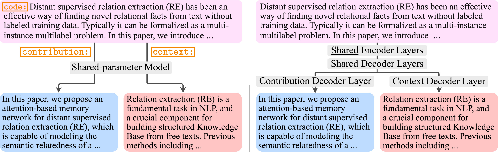
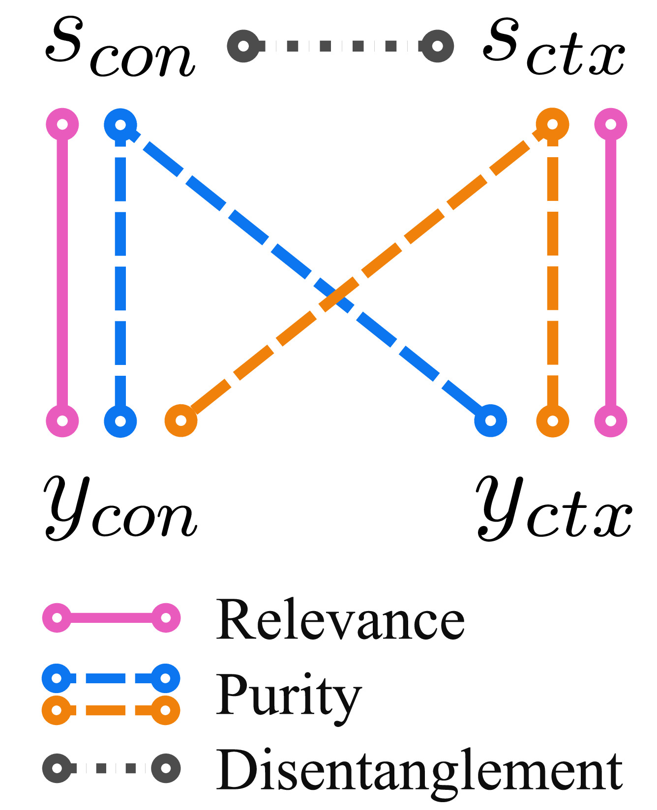

# What's new? Summarizing Contributions in Scientific Literature
Authors: [Hiroaki Hayashi](hiroakih.me), [Wojciech Kryściński](https://twitter.com/iam_wkr), [Bryan McCann](https://bmccann.github.io/), [Nazneen Rajani](http://www.nazneenrajani.com/), [Caiming Xiong](http://cmxiong.com/)

[Paper](https://arxiv.org/abs/2011.03161)

## Introduction

With thousands of academic articles shared on a daily basis, it has become increasingly difficult to keep up with the latest scientific findings.
To overcome this problem, we introduce a new task of disentangled paper summarization, which seeks to generate separate summaries for the paper contributions and the context of the work, making it easier to identify the key findings shared in articles.
For this purpose, we extend the S2ORC corpus of academic articles, which spans a diverse set of domains ranging from economics to psychology, by adding disentangled *contribution* and *context* reference labels.
Together with the dataset, we introduce and analyze three baseline approaches: 

1. a unified model controlled by input code prefixes, 
2. a model with separate generation heads specialized in generating the disentangled outputs, and 
3.  a training strategy that guides the model using additional supervision coming from inbound and outbound citations.

We also propose a comprehensive automatic evaluation protocol which reports the relevance, novelty, and disentanglement of generated outputs.
Through a human study involving expert annotators, we show that in 79%, of cases our new task is considered more helpful than traditional scientific paper summarization.



## Table of Contents

1. [Updates](#updates)
2. [Usage](#usage)
3. [Citation](#citation)
4. [License](#license)

## Updates

11/9/20: Initial code release.

## Usage

First, install the requirements with `requirements.txt`. Please note that we specify `transformers==2.11.0`.

### Generating the Dataset

Follow the procedure [here](filtering/README.md).

### Training Models & Inference
#### Training a model
Use the corresponding scripts in `scripts/` directory to train and decode from the models after modifying the `--datadir` in the scripts.
For example, training ControlCode model would be
```sh
./scripts/train_controlcode.sh exp1
```
where `exp1` is the name of experiment to store all the related data and checkpoints.

#### Decoding from a trained model
Use the corresponding scripts starting with `eval_`. For example, below is the command for evaluating the model trained with the above command.
```sh
./scripts/eval_controlcode.sh exp1 TARGET_TYPE RESULT_DIR SPLIT
```

### Evaluation


Follow the instruction [here](https://github.com/Yale-LILY/SummEval#setup) for setting up the evaluation tool.

For our three-way evaluation, each instance require four summaries as shown on the right: gold standard (contribution, context) summaries and generated (contribution, context) summaries.
ROUGE scores between paired summaries in the figure is calculated first and are aggregated to represent relevance, purity, and disentanglement.

After decoding texts from different models in different modes, you can run `src/evaluate.py` to get ROUGE and BERTScore results. Usage is as follows:
```sh
# Example 1: Comparing references and decoded texts within exp1.
python evaluate.py \
    --exps /path/to/exp1 \
    --output-file exp1-ref_exp1-dec.jsonl

# Example 2: Comparing references from exp1 and decoded texts from exp2.
python evaluate.py \
    --exps /path/to/exp1 /path/to/exp2  \
    --summary-type reference decoded \
    --output-file exp1-ref_exp2-dec.jsonl
```

Using the scripts above, you can obtain all the pairwise evaluations associated to each line on the right figure.
Finally, use `src/calc_metrics.py` to compute the measures used for this task:
```sh
# Relevance:
python calc_metrics.py \
    --contrib-rel /path/to/s_con_y_con.jsonl \
    --context-rel /path/to/s_ctx_y_ctx.jsonl \
    --measure relevance

# Purity:
python calc_metrics.py \
    --contrib-rel /path/to/s_con_y_con.jsonl \
    --context-rel /path/to/s_ctx_y_ctx.jsonl \
    --contrib-cross /path/to/s_con_y_ctx.jsonl \
    --context-cross /path/to/s_ctx_y_con.jsonl \
    --measure purity

# Disentanglement:
python calc_metrics.py \
    --contrib-context /path/to/s_con_s_ctx.jsonl \
    --measure disentanglement
```

See the file for the argument details.


## Citation
```
@article{hayashi2020whats,
  author    = {Hiroaki Hayashi and Wojciech Kry{\'s}ci{\'n}ski and Bryan McCann and Nazneen Rajani and Caiming Xiong},
  title     = {What's new? Summarizing Contributions in Scientific Literature},
  journal   = {arXiv preprint arXiv:2011.03161},
  year      = {2020},
}
```

## License

Copyright (c) 2020, Salesforce.com, Inc.
All rights reserved.

Redistribution and use in source and binary forms, with or without modification, are permitted provided that the following conditions are met:

* Redistributions of source code must retain the above copyright notice, this list of conditions and the following disclaimer.

* Redistributions in binary form must reproduce the above copyright notice, this list of conditions and the following disclaimer in the documentation and/or other materials provided with the distribution.

* Neither the name of Salesforce.com nor the names of its contributors may be used to endorse or promote products derived from this software without specific prior written permission.

THIS SOFTWARE IS PROVIDED BY THE COPYRIGHT HOLDERS AND CONTRIBUTORS "AS IS" AND ANY EXPRESS OR IMPLIED WARRANTIES, INCLUDING, BUT NOT LIMITED TO, THE IMPLIED WARRANTIES OF MERCHANTABILITY AND FITNESS FOR A PARTICULAR PURPOSE ARE DISCLAIMED. IN NO EVENT SHALL THE COPYRIGHT HOLDER OR CONTRIBUTORS BE LIABLE FOR ANY DIRECT, INDIRECT, INCIDENTAL, SPECIAL, EXEMPLARY, OR CONSEQUENTIAL DAMAGES (INCLUDING, BUT NOT LIMITED TO, PROCUREMENT OF SUBSTITUTE GOODS OR SERVICES; LOSS OF USE, DATA, OR PROFITS; OR BUSINESS INTERRUPTION) HOWEVER CAUSED AND ON ANY THEORY OF LIABILITY, WHETHER IN CONTRACT, STRICT LIABILITY, OR TORT (INCLUDING NEGLIGENCE OR OTHERWISE) ARISING IN ANY WAY OUT OF THE USE OF THIS SOFTWARE, EVEN IF ADVISED OF THE POSSIBILITY OF SUCH DAMAGE.
